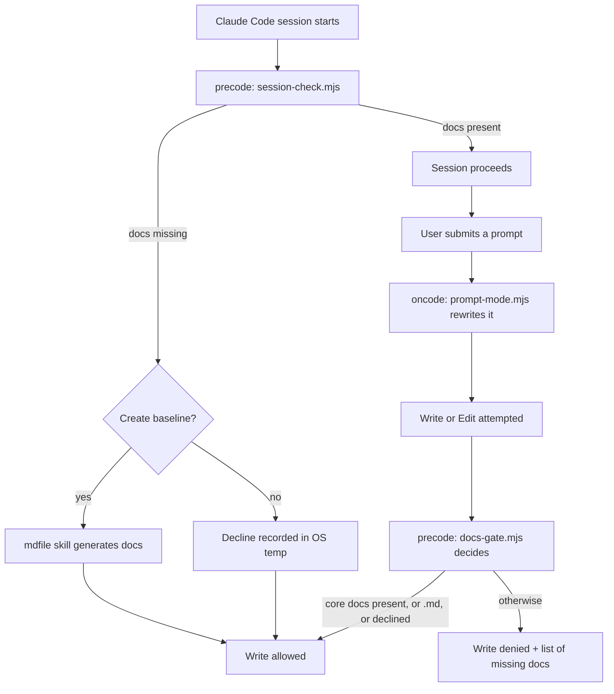

# Architecture

## Overview

OFTagents is a Claude Code plugin marketplace. The root `.claude-plugin/marketplace.json`
is a catalog and nothing else; each plugin lives in its own top-level directory and is
attached to the catalog by a relative `source` path. Plugins are made of interpreted files
— JSON manifests, markdown skills, and Node scripts invoked as hooks — so there is no build
step, no dependency tree, and no package manifest. A plugin is installed by pointing Claude
Code at this repository, and it takes effect the next time a session starts.

Two plugins ship today. `precode` intervenes *before* code is written, requiring a
documentation baseline and generating it on request. `oncode` intervenes *while* code is
being written, rewriting each submitted prompt into a cheaper, more executable form.

## Context

| Actor / System | Direction | Purpose |
| --- | --- | --- |
| Claude Code runtime | both | Loads `marketplace.json`, registers hooks, invokes the scripts with a JSON payload on stdin and reads their JSON verdict on stdout. |
| Node.js (≥ 18, developed on v24) | out | The only runtime the scripts need. Standard library only — no dependencies are installed or vendored. |
| The user's project | in | Read-only. Scripts inspect the project root to decide whether required documents exist; they never write into it. |
| Operating-system temp directory | out | The sole write target: `precode` records a per-session "no" there rather than in the user's repository. |
| GitHub (`OFThub/OFTagents`) | out | Distribution. `/plugin marketplace add` reads this repository directly. |

## Components

| Component | Responsibility | Talks to |
| --- | --- | --- |
| Marketplace catalog | Lists every plugin and its relative source. The only file Claude Code reads to discover the repository's contents. | Claude Code runtime |
| `precode` gate | A pure decision function over a write attempt: allow, or deny with the list of missing documents. Writes nothing. | `required-docs.json`, Claude Code `PreToolUse` |
| `precode` session check | Asks once per session whether to create the missing baseline, and records a decline. | `required-docs.json`, temp directory |
| `mdfile` skill | Profiles the project, then generates the missing documents against their published standards. | `required-docs.json`, templates, project files |
| `oncode` prompt optimizer | Rewrites each submitted prompt toward the shape Claude Code executes with the fewest tokens. | `prompt-rules.json`, Claude Code `UserPromptSubmit` |
| `ideal-prompt` skill | The prompt-shaping reference the optimizer applies. | `oncode/config/prompt-rules.json` |

Both gates share one property worth stating explicitly: they **fail open**. A script that
throws, times out, or emits unparseable output lets the action proceed. A broken guard must
not be able to lock a session.

## Directory map

| Path | Contains |
| --- | --- |
| `.claude-plugin/marketplace.json` | The catalog. A new plugin is registered here. |
| `precode/` | The documentation-baseline plugin. |
| `precode/.claude-plugin/plugin.json` | Plugin manifest — name, version, license. |
| `precode/config/required-docs.json` | The required document set. Read by both the gate and the `mdfile` skill. |
| `precode/scripts/docs-gate.mjs` | `decide()`, `missingDocs()`, `declinePath()`, `denyPayload()` plus a thin CLI shell. |
| `precode/scripts/session-check.mjs` | The `SessionStart` question and the `--decline` writer. |
| `precode/scripts/docs-gate.test.mjs` | 18 `node:test` cases. No framework, no disk access. |
| `precode/hooks/hooks.json` | Registers `SessionStart` and `PreToolUse: Write\|Edit`. |
| `precode/commands/docs.md` | The `/precode:docs` command. |
| `precode/skills/mdfile/` | `SKILL.md`, `references/`, and `assets/templates/`. |
| `oncode/` | The prompt-optimization plugin. |
| `oncode/.claude-plugin/plugin.json` | Plugin manifest. |
| `oncode/config/prompt-rules.json` | Rewrite rules for the optimizer. |
| `oncode/scripts/prompt-mode.mjs` | The `UserPromptSubmit` rewriter. |
| `oncode/scripts/prompt-mode.test.mjs` | 25 `node:test` cases. |
| `oncode/hooks/hooks.json` | Registers `UserPromptSubmit`. |
| `oncode/skills/ideal-prompt/` | `SKILL.md` and `references/`. |
| `docs/adr/` | Architecture decision records. |
| `docs/PLAN.md` | Working audit and plan notes. |
| `.github/` | Pull request and issue templates. |

## Key decisions

See [docs/adr/](docs/adr/).

| ADR | Decision |
| --- | --- |
| [0001](docs/adr/0001-record-architecture-decisions.md) | Record architecture decisions |

Decisions already load-bearing in the code, pending their own records:

- **Node instead of shell.** `jq` is not present on a standard Windows install; Node is
  everywhere Claude Code is.
- **The gate is a pure function and writes nothing.** A check with side effects leaves files
  in the user's project without permission.
- **Fail open, always.** See Components.
- **Session declines live in the OS temp directory**, keyed by session id — never inside the
  user's project.

## Constraints

- Every in-plugin path MUST be written as `${CLAUDE_PLUGIN_ROOT}/…`. Absolute paths are never
  correct — the install location is not knowable at authoring time.
- Component directories (`commands/`, `hooks/`, `scripts/`, `skills/`) MUST sit at the plugin
  root. `.claude-plugin/` holds the manifest only.
- `.md` MUST remain in the `allowExtensions` list of `required-docs.json`. Removing it makes
  the gate block the very documents it demands, and the project deadlocks. `docs-gate.test.mjs`
  pins this with an explicit deadlock-guard test.
- "Which documents are missing" MUST be computed in exactly one place, `missingDocs()`. The
  gate and the session question call the same function; a second copy drifts, and a drifted
  gate becomes impossible to satisfy.
- The required-document list MUST stay in configuration, never inline in `docs-gate.mjs`.
- `declinePath()` MUST reject anything that is not a plain session id rather than attempt to
  sanitize it. The id arrives from an external payload.
- Hook changes load only when Claude Code restarts. Restart the session before testing one.
