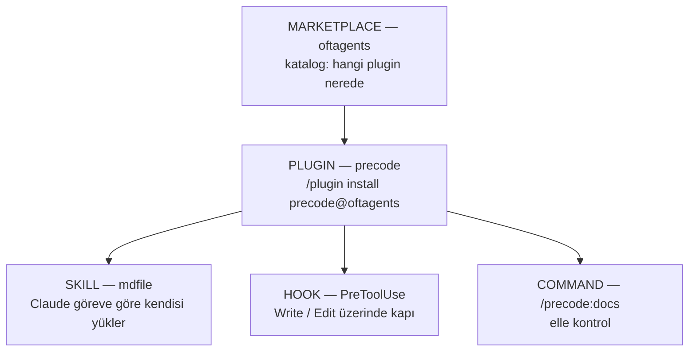

<div align="center">

# OFTagents

### Claude Code için ajan plugin marketplace'i

**Konvansiyon rica eder, kapı zorlar.**
Dokümansız bir projeye kod yazılmasını deterministik olarak engelleyen plugin'ler
ve onları besleyen skill'ler.

<br/>

[](LICENSE)
[](https://docs.claude.com/en/docs/claude-code)


[](https://github.com/OFThub/OFTagents/stargazers)

<br/>

<table>
<tr>
<td width="25%" align="center">
  <a href="#-kurulum"><strong>Kurulum</strong><br/><sub>iki komut, sonra yeniden başlat</sub></a>
</td>
<td width="25%" align="center">
  <a href="#-katalog"><strong>Katalog</strong><br/><sub>mevcut plugin'ler</sub></a>
</td>
<td width="25%" align="center">
  <a href="precode/"><strong>precode</strong><br/><sub>dokümantasyon kapısı</sub></a>
</td>
<td width="25%" align="center">
  <a href="#-yeni-plugin-ekleme"><strong>Genişletme</strong><br/><sub>kod yazmadan plugin ekle</sub></a>
</td>
</tr>
</table>

</div>

---

> [!TIP]
> **Acelesi olanlar için.** İki satır, ardından Claude Code'u yeniden başlatın:
> ```
> /plugin marketplace add OFThub/OFTagents
> /plugin install precode@oftagents
> ```

---

## Neden var

Claude Code, README'si olmayan bir projeye seve seve kod yazmaya başlar. Dokümanlar ya hiç
yazılmaz ya da iş bittikten çok sonra, hatırlanabildiği kadarıyla yazılır.

Bunu tek başına bir **skill** çözemez — skill'leri model kendi takdirine göre yükler.
"Yazmadan önce kontrol et" garantisi ancak bir **hook** ile deterministik olur. OFTagents'in
altındaki plugin'ler bu ikisini birlikte paketler: hook *ne zaman*, skill *nasıl*.

## Üç katman

Bir skill doğrudan kurulamaz. Kurulabilir birim **plugin**'dir; skill onun içinde gelir.



Kurulum plugin'i hedefler, tetikleme skill'i. Bir plugin birden fazla skill, komut, hook ve
agent taşıyabilir; hepsi plugin kurulunca birlikte gelir.

## 📦 Kurulum

<table>
<tr><th align="left">Kaynak</th><th align="left">Komut</th><th align="left">Ne zaman</th></tr>
<tr>
<td><strong>GitHub</strong> (önerilen)</td>
<td><code>/plugin marketplace add OFThub/OFTagents</code></td>
<td>normal kullanım</td>
</tr>
<tr>
<td>GitHub, tam URL</td>
<td><code>/plugin marketplace add https://github.com/OFThub/OFTagents</code></td>
<td>kısayol biçimini sevmiyorsanız</td>
</tr>
<tr>
<td>Yerel klasör</td>
<td><code>/plugin marketplace add C:\Projects\OFTagents</code></td>
<td>geliştirirken, push etmeden denemek için</td>
</tr>
</table>

Kaynağı ekledikten sonra plugin'i kurun:

```
/plugin install precode@oftagents
```

> [!IMPORTANT]
> Ardından Claude Code'u **yeniden başlatın**. Hook'lar yalnızca oturum başında yüklenir —
> yeniden başlatmadan kapı devreye girmez. `/hooks` ile `PreToolUse` girdisinin listelendiğini
> doğrulayabilirsiniz.

Claude Code iki GitHub biçimini farklı kaydeder (`source: github` ve `source: git`), davranış
aynıdır.

## 🗂 Katalog

| Plugin | Ne yapar | Sürüm | Bileşenler |
| --- | --- | --- | --- |
| **[precode](precode/)** | Oturum başında bir kez sorar; cevapsız kalırsa ilk kod yazımını engeller ve sektör standardı `.md` setini ürettirir | `0.1.0` | 2 hook · 1 skill · 1 komut |

## 🧩 Yeni plugin ekleme

<details>
<summary><strong>Marketplace'e yeni bir plugin eklemek — kod değişikliği yok</strong></summary>

<br/>

1. Kökte yeni bir klasör açın: `OFTagents/<plugin-adi>/`
2. İçine `.claude-plugin/plugin.json` koyun — en az `name`, ayrıca `version` ve `description`:

   ```json
   {
     "name": "<plugin-adi>",
     "version": "0.1.0",
     "description": "Tek cümlede ne yaptığı."
   }
   ```

3. `.claude-plugin/marketplace.json` içindeki `plugins` dizisine kayıt düşün:

   ```json
   {
     "name": "<plugin-adi>",
     "description": "Katalogda görünecek açıklama.",
     "source": "./<plugin-adi>",
     "category": "documentation"
   }
   ```

`source` **göreli** yazılır. Bu sayede aynı katalog hem yerel klasörden hem GitHub'dan
çalışır; repo taşınırsa tek satır değişmez.

</details>

<details>
<summary><strong>Mevcut bir plugin'e skill / komut / agent eklemek</strong></summary>

<br/>

| Eklenen | Nereye | Kayıt gerekir mi |
| --- | --- | --- |
| Skill | `<plugin>/skills/<ad>/SKILL.md` | Hayır — otomatik keşfedilir |
| Komut | `<plugin>/commands/<ad>.md` | Hayır — otomatik keşfedilir |
| Agent | `<plugin>/agents/<ad>.md` | Hayır — otomatik keşfedilir |
| Hook | `<plugin>/hooks/hooks.json` | Dosya varsa yeterli |

`.claude-plugin/` klasörü **yalnızca manifest'i** tutar. Bileşen klasörleri plugin
**kökünde** durur.

</details>

## 🏗 Depo yapısı

```
OFTagents/
├── .claude-plugin/marketplace.json    ← katalog: yeni plugin buraya kaydedilir
├── LICENSE
├── README.md
├── CLAUDE.md                          ← Claude'a talimat (bu repo üzerinde çalışırken)
├── CHANGELOG.md
└── precode/                           ← PLUGIN
    ├── .claude-plugin/plugin.json
    ├── config/required-docs.json      ← tek doğruluk kaynağı
    ├── hooks/hooks.json
    ├── scripts/docs-gate.mjs          ← saf decide() + ince CLI kabuğu
    ├── scripts/session-check.mjs      ← oturum sorusu + --decline yazıcısı
    ├── scripts/docs-gate.test.mjs
    ├── commands/docs.md
    └── skills/mdfile/                 ← SKILL
        ├── SKILL.md
        ├── references/doc-catalog.md
        └── assets/templates/
```

## 🧪 Geliştirme

```bash
node precode/scripts/docs-gate.test.mjs
```

Build adımı yok, bağımlılık yok, `package.json` yok. Kapı yalnızca Node yerleşiklerini
kullanır ve `decide()` saf bir fonksiyon olduğu için testler diske hiç dokunmaz.

| Ölçüm | Durum |
| --- | --- |
| Birim testi | 18 / 18 |
| Bağımlılık | 0 |
| Gerekli Node | ≥ 18 |

## 📐 Tasarım kuralları

Bu kurallar zevk meselesi değil; her biri yaşanmış bir arıza sınıfını kapatıyor.

| Kural | Neden |
| --- | --- |
| Plugin içi her yol `${CLAUDE_PLUGIN_ROOT}` ile | Mutlak yol başka makinede çalışmaz |
| Bileşen klasörleri plugin kökünde | `.claude-plugin/` yalnızca manifest içindir |
| Kabuk script'i değil Node | `jq` standart Windows'ta yok, Node her yerde var |
| Kapı hiçbir şey yazmaz | Salt-okunur kontrol, kullanıcının projesine izinsiz dosya bırakmamalı |
| Fail-open | Bozuk bir kapı oturumu kilitlememeli |

---

<div align="center">
<sub>

**OFTagents** · MIT · [Ömer Faruk TÜRKDOĞDU](https://github.com/OFThub)

</sub>
</div>
