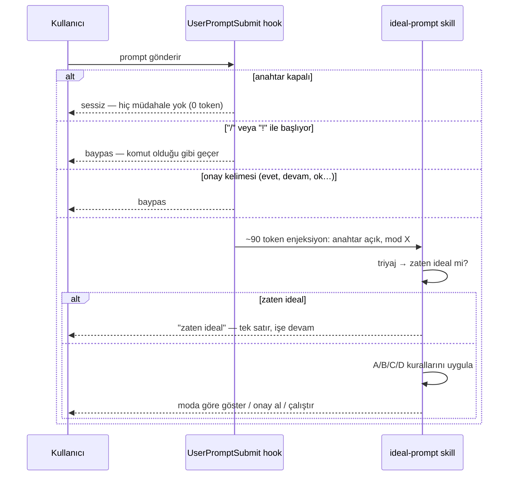

<div align="center">

# oncode

### Kod yazarken çalışan skill'ler

İlk skill: **ideal-prompt** — attığınız prompt'u, Claude Code'un **en az token harcayarak**
doğru sonuca ulaşacağı biçime çevirir. Daha kısa değil; **daha sınırlı**.

<br/>

[](.claude-plugin/plugin.json)
[](../LICENSE)


</div>

---

> [!TIP]
> ```
> /plugin marketplace add OFThub/OFTagents
> /plugin install oncode@oftagents
> ```
> Sonra Claude Code'u **yeniden başlatın** — hook'lar yalnızca oturum başında yüklenir.
> Geliştirme için yerel yol da çalışır: `/plugin marketplace add C:\Projects\OFTagents`

---

## Neden

Bir prompt 50–500 token. O prompt'un tetiklediği **yürütme** 20.000–200.000 token.
Yani "prompt'u kısalt" yanlış yüzeyi optimize eder.

Aşağıdaki iki satır uydurma değil — [ölçüm bölümündeki](#kanıt--ölçülmüş-tahmin-değil)
`bugfix` vakasının gerçek sayıları:

| Prompt | Karakter | Girdi | Çıktı | Tur | Maliyet |
|---|---:|---:|---:|---:|---:|
| `fix the login bug` | 17 | 400.620 | 2.221 | 10 | $0.3881 |
| `src/auth/token.js: refreshToken() returns null when the token has already expired… Verify with: node --test test/auth.test.js. Touch only src/auth/.` | 277 | 325.038 | **812** | **5** | **$0.3243** |

Prompt 260 karakter büyüdü; çıktı **%63**, tur sayısı **yarı yarıya**, maliyet **%16** düştü —
ve iki kol da hatayı gerçekten düzeltti. `ideal-prompt` bu dönüşümü yapar.

## Üç token yüzeyi

Her kural, kestiği yüzeye göre gruplanır. Aşağıdaki büyüklükler **tahmindir**; bu depoda
fiilen ölçülen değerler [Kanıt bölümünde](#kanıt--ölçülmüş-tahmin-değil).

| Yüzey | Büyüklük | Fiyat | Grup |
|---|---|---|---|
| **Yörünge** — ajanın yaptığı okuma, arama, düzeltme | 15k–120k | girdi | **A** |
| **Yapı** — talimata uyum, yeniden çalışma, cache isabeti | 2k–20k | girdi | **B** |
| **Çıktı** — modelin ürettiği metin | 5k–40k | **~5× girdi**, üstelik her tur yeniden gönderilir | **C** |

## Akış



---

## Kanıt — ölçülmüş, tahmin değil

Aşağıdaki sayılar `claude -p --output-format json` çağrılarının kendi `usage` bloğundan
okundu. Hiçbiri modelleme değil, tekrar üretebilirsiniz:

```bash
node oncode/bench/bench.mjs --dry-run        # ne çalışacağını gösterir, hiç harcamaz
node oncode/bench/bench.mjs --model sonnet   # ölçer, gerçek para harcar (~$2)
```

### Sonuç — Sonnet 5, 2026-08-20, `n=1`

| Vaka | Kol | Prompt karakter | Girdi token | Çıktı token | Tur | Maliyet | Görev tamam |
|---|---|---:|---:|---:|---:|---:|---|
| bugfix | ham | 17 | 400.620 | 2.221 | 10 | $0.3881 | evet |
| bugfix | ideal | 277 | 325.038 | 812 | 5 | $0.3243 | evet |
| **bugfix** | **fark** | +260 | **−75.582** (−19%) | **−1.409** (−63%) | −5 | **−$0.0637** (−16%) | |
| explain | ham | 30 | 262.851 | 2.150 | 13 | $0.3406 | — |
| explain | ideal | 144 | 259.011 | 686 | 4 | $0.2999 | — |
| **explain** | **fark** | +114 | **−3.840** (−1%) | **−1.464** (−68%) | −9 | **−$0.0407** (−12%) | |
| review | ham | 60 | 263.347 | 6.357 | 13 | $0.5845 | — |
| review | ideal | 156 | 259.144 | 2.355 | 5 | $0.3262 | — |
| **review** | **fark** | +96 | **−4.203** (−2%) | **−4.002** (−63%) | −8 | **−$0.2583** (**−44%**) | |

**Toplam:** girdi 926.818 → 843.193 (−%9) · çıktı 10.728 → 3.853 (**−%64**) ·
tur 36 → 14 · maliyet $1.3132 → $0.9505 (**−%28**)

### Sayıların nasıl okunması gerektiği

**Girdi yüzdesi yanıltıcıdır, çıktı yüzdesi değildir.** Her koşu ~259.000 token'lık sabit bir
taban ödüyor (oturum ve harness yükü). `explain` ile `review` salt-okunur görevler olduğu için
ikisi de bu tabanın hemen üstünde kalıyor — 262k'ya karşı 259k. Tabanı çıkarınca `review`
farkı 4.336 → 133 token, yani **−%97**. Tablodaki −%2, tabanla seyreltilmiş hâlidir.

**Asıl kazanç çıktıda ve nedeni fiyat.** Çıktı token'ı girdiden ~5× pahalı, üstelik bağlama
girip sonraki her turda yeniden gönderiliyor. Üç vakada da −%63 ile −%68 arası düşüş var ve
bunu tek bir kural sağlıyor: **C1, çıktı formatını somut sınırla.**

**Tur sayısı yörüngenin doğrudan ölçüsü.** 10→5, 13→4, 13→5. Girdi tabanı bunu maskeliyor
ama tur sayısı maskelenmiyor.

### Yöntem

| Karar | Neden |
|---|---|
| Her kol **ayrı fixture kopyasında** | Ham kol dosyayı düzeltirse ideal kol düzeltilmiş repoda çalışır, ölçüm çöpe gider |
| Fixture'da **planlı bir hata** | `refreshToken()` süresi dolmuş token'da `null` dönüyor; `test/auth.test.js` yakalıyor |
| Fixture'da **alakasız modüller** | `src/api/`, `src/db/`, `src/utils/` — sınırsız keşfin maliyeti olsun diye |
| `bugfix`'te **objektif başarı kontrolü** | Koşu bitince test çalıştırılıyor. Bu olmadan "daha ucuz", "daha az iş yaptı" ile aynı şeye çökerdi |
| **Hook'lar ve MCP kapalı** (`--settings '{"disableAllHooks":true}' --strict-mcp-config`) | Aşağıdaki kutuya bakın — bu bir kolaylık değil, geçerlilik şartı |

> [!IMPORTANT]
> **İlk iki ölçüm geçersizdi ve sebebi bu deponun kendi plugin'leriydi.**
>
> Hook'lar açıkken **precode kapısı** fixture'daki her `Edit`'i reddetti (fixture'da
> `CLAUDE.md` yok). Aynı anda **oncode'un kendi `UserPromptSubmit` hook'u** ham kola da
> "ideal-prompt uygula" talimatını enjekte etti. Sonuç: iki kol da hatayı düzeltmeye değil,
> bir kapıyla boğuşmaya token harcadı, ve ham kol da ideal talimatı aldığı için karşılaştırma
> tanımı gereği yok oldu. O koşuda ideal kol **daha pahalı** görünüyordu (663k vs 490k) —
> ölçülen şey "kim daha hızlı pes etti"ydi.
>
> Teşhis `permission_denials` alanındaydı ve ilk sürümde kaydedilmiyordu. Artık kaydediliyor
> ve tablonun altına uyarı basılıyor. Bir prompt'un benchmark'ı yalnızca prompt'u görmelidir.

### Dürüstlük notları

- **`n=1`.** LLM çağrıları belirlenimci değildir. Bu sayılar bir büyüklük mertebesi gösterir,
  garanti vermez. Tekrar çalıştırırsanız farklı ama aynı yönde sayılar alırsınız.
- **`review/ideal` bir `Bash` reddi aldı** (`--allowedTools` yalnızca `Bash(node:*)` veriyor).
  Reddedilen çağrı bir turu boşa harcar, yani ideal kolu **olduğundan pahalı** gösterir.
  Sonucu tersine çevirmez; −%44'lük maliyet kazancı bu handikapa rağmen elde edildi.
- **`explain` ve `review` vakalarında objektif başarı kontrolü yok.** İkisi de salt-okunur;
  çıktının doğruluğu okunarak değerlendirilmeli. Sayılar maliyeti kanıtlar, kaliteyi değil.
- **Sabit taban ölçümde mevcut** ve mutlak sayılara dahil. Bu yüzden girdi yüzdeleri gerçek
  yörünge kazancını **olduğundan düşük** gösterir.
- Ham sayılar `oncode/bench/results.json` içinde; koşu kaydı `oncode/bench/last-run.log`.

## Komutlar

Anahtar **kapalı başlar**. Açana kadar hiçbir prompt'a dokunulmaz.

| Komut | Ne yapar |
|---|---|
| `/oncode:ideal-prompt --open` | Bundan sonraki tüm prompt'lar idealleştirilir |
| `/oncode:ideal-prompt --close` | Kapatır. Tekrar `--open` denene kadar dokunulmaz |
| `/oncode:ideal-prompt --review` | **Varsayılan.** Yeniden yazımı + gerekçeyi gösterir, onay alır, çalıştırır |
| `/oncode:ideal-prompt --advise` | Sadece gösterir, çalıştırmaz |
| `/oncode:ideal-prompt --auto` | Sessizce yeniden yazıp çalıştırır, gerekçe basmaz |
| `/oncode:ideal-prompt --language tr` | Üretilen **kod içi** yorum/log dilini sabitler |
| `/oncode:ideal-prompt --status` | Durumu bildirir, değiştirmez |
| `/oncode:ideal-prompt <metin>` | Tek seferlik optimizasyon, anahtardan bağımsız |

Anahtar `~/.claude/oncode/state.json` içinde yaşar — **projenize hiçbir şey yazılmaz** ve
ayar oturumlar arası korunur.

## Dil

İki ayrı dil kararı var ve karıştırılmamalı:

| Ne | Dil | Neden |
|---|---|---|
| Optimize prompt | **İngilizce** (sabit) | Tokenizer'da ~1.8–2.5× verim + kod tabanının yüzeyi (yol, sembol, test adı) zaten İngilizce |
| Size gelen açıklama | **Sizin diliniz** | Kazanç prompt'ta, maliyet insanda. İkisi ayrı tutulur |
| Kod içi yorum/log | `--language` | `auto` = düzenlenen dosyanın kendi dili, sinyal yoksa İngilizce |

> [!NOTE]
> TR/EN oranı (~1.8–2.5×) bir **tahmindir**, ölçüm değil. Sondan eklemeli morfoloji, köklerin
> BPE sözlüğünde bütün bulunmaması ve `ğ ş ı ç ö ü` karakterlerinin byte-fallback'e düşmesi
> birikir. Gerçek oran metne göre değişir.

**Çeviri koruması:** yapıştırdığınız hata metni, log satırı, dosya yolu, komut ve tırnak
içindeki ifadeniz **çevrilmez**. Bir hata metnini çevirmek `grep` eşleşmesini öldürür.

## Bağlam basıncı

Hook, transcript dosyasının boyutunu `stat` ile ölçer — tek syscall, sıfır token, dosya
ayrıştırılmaz. Eşik aşılınca enjeksiyona tek satır eklenir:

- **`/clear`** — ilgisiz bir göreve geçiyorsanız
- **`/compact <odak>`** — aynı uzun görev sürüyorsa

> [!IMPORTANT]
> Hook `/compact`'i **çalıştırmaz, öneremekle yetinir.** Bir hook slash komutu çalıştıramaz
> ve compaction yıkıcıdır — yanlış anda tetiklenirse devam eden işin durumunu siler.
> Uyarı, transcript her `contextWarnBytes` kadar daha büyüdüğünde tekrar eder; her prompt'ta değil.

## Ödün — gizlenmiyor

**Anahtar açıkken idealleştirme bedava değil.** Baypas edilmeyen her prompt fazladan bir
optimizasyon turu (~500–1500 token) ekler.

| Durum | Sonuç |
|---|---|
| Sınırsız prompt | **Ölçülen:** maliyet −%12 … −%44 · çıktı −%63 … −%68 · tur ~yarı |
| Zaten çapalanmış prompt | Kayıp — triyaj tek satırda çıkar ama sıfırlamaz |
| Baypas edilen prompt (`/`, `!`, onay) | 0 token, hiç çalışmaz |

> [!NOTE]
> Bu satırlar daha önce "10–50× kazanç" diyordu. Benchmark bunu **desteklemedi** ve iddia
> ölçülen değerlerle değiştirildi. Kazanç gerçek ama bir büyüklük mertebesi değil: üç vakada
> toplam maliyet −%28.
Beğenmediyseniz çıkış tek komut: `/oncode:ideal-prompt --close`

## Özelleştirme

Tüm kurallar [`config/prompt-rules.json`](config/prompt-rules.json) içinde — kod değişmez:

| Alan | Ne yapar |
|---|---|
| `modes`, `defaultMode` | Çıktı modları |
| `bypassPrefixes`, `bypassExact` | Hangi prompt'lara hiç dokunulmayacağı |
| `structureThresholdChars` | XML iskeletinin kârlı hâle geldiği eşik |
| `contextWarnBytes` | Bağlam uyarısı eşiği ve tekrar aralığı |
| `injectionBudgetChars` | Enjeksiyonun karakter tavanı — testle sabitli |
| `promptLanguage` | Optimize prompt'un dili |

> [!WARNING]
> `bypassPrefixes` içinden `"/"` **asla çıkarılmamalı.** Çıkarılırsa `--close` komutunun
> kendisi yakalanır ve anahtar bir daha kapanmaz. `prompt-mode.test.mjs` bunu
> *switch-off deadlock guard* testiyle korur.

## Geliştirme

```bash
node oncode/scripts/prompt-mode.test.mjs     # 25 test, framework yok, disk yok
node oncode/bench/bench.mjs --dry-run        # benchmark planini goster, hic harcama
node oncode/bench/bench.mjs --case bugfix    # tek vaka olc (2 cagirim)
```

| Yol | İçerik |
|---|---|
| `config/prompt-rules.json` | Tek doğruluk kaynağı — hook ve skill aynı dosyadan okur |
| `scripts/prompt-mode.mjs` | Saf fonksiyonlar + ince CLI kabuğu |
| `hooks/hooks.json` | `UserPromptSubmit` kaydı |
| `skills/ideal-prompt/` | `SKILL.md` + `references/` |
| `bench/bench.mjs` | Olcum harness'i — `claude -p` cagirir, gercek `usage` okur |
| `bench/cases.json` | Vaka tanimlari: her biri farkli bir kural grubunu sinar |
| `bench/fixture/` | Planli hatali mini proje + alakasiz modul gurultusu |

**Fail-open yönü precode'un tersidir.** precode çökerse yazmaya *izin verir*; oncode çökerse
*idealleştirmez*. Bozuk bir optimizer'ın prompt'lara müdahale etmesi, hiç etmemesinden kötüdür.
Bozuk state dosyası da "kapalı" sayılır.

## Kapatma

```
/oncode:ideal-prompt --close     # sadece skill'i sustur
/plugin uninstall oncode         # tamamen kaldır
```
