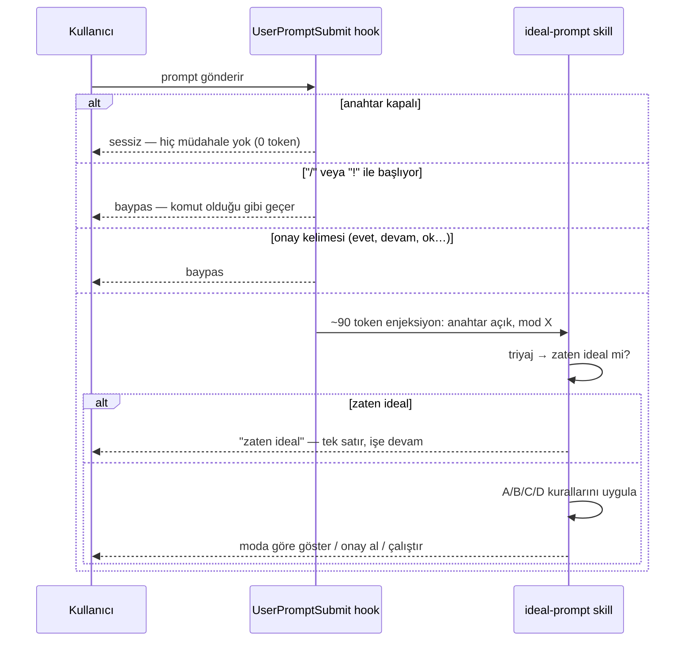

<div align="center">

# oncode

### Kod yazarken çalışan skill'ler

İlk skill: **ideal-prompt** — attığınız prompt'u, Claude Code'un **en az token harcayarak**
doğru sonuca ulaşacağı biçime çevirir. Daha kısa değil; **daha sınırlı**.

<br/>

[](.claude-plugin/plugin.json)
[](../LICENSE)


</div>

---

> [!TIP]
> ```
> /plugin marketplace add OFThub/OFTagents
> /plugin install oncode@oftagents
> ```
> Sonra Claude Code'u **yeniden başlatın** — hook'lar yalnızca oturum başında yüklenir.
> Geliştirme için yerel yol da çalışır: `/plugin marketplace add C:\Projects\OFTagents`

---

## Neden

Bir prompt 50–500 token. O prompt'un tetiklediği **yürütme** 20.000–200.000 token.
Yani "prompt'u kısalt" yanlış yüzeyi optimize eder.

| Prompt | Prompt | Yürütme |
|---|---|---|
| `login hatasını düzelt` | ~8 token | 40k–120k (kör keşif + 3-4 düzeltme turu) |
| `src/auth/token.ts: refresh fails after session timeout. Write a failing test first, then fix. Verify with npm test -- auth. Touch only src/auth/.` | ~40 token | 6k–15k |

Prompt 32 token büyüdü, yürütme **~8× küçüldü**. `ideal-prompt` bu dönüşümü yapar.

## Üç token yüzeyi

Her kural, kestiği yüzeye göre gruplanır:

| Yüzey | Büyüklük | Fiyat | Grup |
|---|---|---|---|
| **Yörünge** — ajanın yaptığı okuma, arama, düzeltme | 15k–120k | girdi | **A** |
| **Yapı** — talimata uyum, yeniden çalışma, cache isabeti | 2k–20k | girdi | **B** |
| **Çıktı** — modelin ürettiği metin | 5k–40k | **~5× girdi**, üstelik her tur yeniden gönderilir | **C** |

## Akış



## Komutlar

Anahtar **kapalı başlar**. Açana kadar hiçbir prompt'a dokunulmaz.

| Komut | Ne yapar |
|---|---|
| `/oncode:ideal-prompt --open` | Bundan sonraki tüm prompt'lar idealleştirilir |
| `/oncode:ideal-prompt --close` | Kapatır. Tekrar `--open` denene kadar dokunulmaz |
| `/oncode:ideal-prompt --review` | **Varsayılan.** Yeniden yazımı + gerekçeyi gösterir, onay alır, çalıştırır |
| `/oncode:ideal-prompt --advise` | Sadece gösterir, çalıştırmaz |
| `/oncode:ideal-prompt --auto` | Sessizce yeniden yazıp çalıştırır, gerekçe basmaz |
| `/oncode:ideal-prompt --language tr` | Üretilen **kod içi** yorum/log dilini sabitler |
| `/oncode:ideal-prompt --status` | Durumu bildirir, değiştirmez |
| `/oncode:ideal-prompt <metin>` | Tek seferlik optimizasyon, anahtardan bağımsız |

Anahtar `~/.claude/oncode/state.json` içinde yaşar — **projenize hiçbir şey yazılmaz** ve
ayar oturumlar arası korunur.

## Dil

İki ayrı dil kararı var ve karıştırılmamalı:

| Ne | Dil | Neden |
|---|---|---|
| Optimize prompt | **İngilizce** (sabit) | Tokenizer'da ~1.8–2.5× verim + kod tabanının yüzeyi (yol, sembol, test adı) zaten İngilizce |
| Size gelen açıklama | **Sizin diliniz** | Kazanç prompt'ta, maliyet insanda. İkisi ayrı tutulur |
| Kod içi yorum/log | `--language` | `auto` = düzenlenen dosyanın kendi dili, sinyal yoksa İngilizce |

> [!NOTE]
> TR/EN oranı (~1.8–2.5×) bir **tahmindir**, ölçüm değil. Sondan eklemeli morfoloji, köklerin
> BPE sözlüğünde bütün bulunmaması ve `ğ ş ı ç ö ü` karakterlerinin byte-fallback'e düşmesi
> birikir. Gerçek oran metne göre değişir.

**Çeviri koruması:** yapıştırdığınız hata metni, log satırı, dosya yolu, komut ve tırnak
içindeki ifadeniz **çevrilmez**. Bir hata metnini çevirmek `grep` eşleşmesini öldürür.

## Bağlam basıncı

Hook, transcript dosyasının boyutunu `stat` ile ölçer — tek syscall, sıfır token, dosya
ayrıştırılmaz. Eşik aşılınca enjeksiyona tek satır eklenir:

- **`/clear`** — ilgisiz bir göreve geçiyorsanız
- **`/compact <odak>`** — aynı uzun görev sürüyorsa

> [!IMPORTANT]
> Hook `/compact`'i **çalıştırmaz, öneremekle yetinir.** Bir hook slash komutu çalıştıramaz
> ve compaction yıkıcıdır — yanlış anda tetiklenirse devam eden işin durumunu siler.
> Uyarı, transcript her `contextWarnBytes` kadar daha büyüdüğünde tekrar eder; her prompt'ta değil.

## Ödün — gizlenmiyor

**Anahtar açıkken idealleştirme bedava değil.** Baypas edilmeyen her prompt fazladan bir
optimizasyon turu (~500–1500 token) ekler.

| Durum | Sonuç |
|---|---|
| Sınırsız prompt (`"şunu düzelt"`) | **10–50× kazanç** |
| Zaten çapalanmış prompt | ~%2 kayıp — triyaj tek satırda çıkar ama sıfırlamaz |
| Baypas edilen prompt (`/`, `!`, onay) | 0 token, hiç çalışmaz |

Kâr eşiği: yörüngeden ~2k token kırpan bir yeniden yazım kendini öder.
Beğenmediyseniz çıkış tek komut: `/oncode:ideal-prompt --close`

## Özelleştirme

Tüm kurallar [`config/prompt-rules.json`](config/prompt-rules.json) içinde — kod değişmez:

| Alan | Ne yapar |
|---|---|
| `modes`, `defaultMode` | Çıktı modları |
| `bypassPrefixes`, `bypassExact` | Hangi prompt'lara hiç dokunulmayacağı |
| `structureThresholdChars` | XML iskeletinin kârlı hâle geldiği eşik |
| `contextWarnBytes` | Bağlam uyarısı eşiği ve tekrar aralığı |
| `injectionBudgetChars` | Enjeksiyonun karakter tavanı — testle sabitli |
| `promptLanguage` | Optimize prompt'un dili |

> [!WARNING]
> `bypassPrefixes` içinden `"/"` **asla çıkarılmamalı.** Çıkarılırsa `--close` komutunun
> kendisi yakalanır ve anahtar bir daha kapanmaz. `prompt-mode.test.mjs` bunu
> *switch-off deadlock guard* testiyle korur.

## Geliştirme

```bash
node oncode/scripts/prompt-mode.test.mjs     # 25 test, framework yok, disk yok
```

| Yol | İçerik |
|---|---|
| `config/prompt-rules.json` | Tek doğruluk kaynağı — hook ve skill aynı dosyadan okur |
| `scripts/prompt-mode.mjs` | Saf fonksiyonlar + ince CLI kabuğu |
| `hooks/hooks.json` | `UserPromptSubmit` kaydı |
| `skills/ideal-prompt/` | `SKILL.md` + `references/` |

**Fail-open yönü precode'un tersidir.** precode çökerse yazmaya *izin verir*; oncode çökerse
*idealleştirmez*. Bozuk bir optimizer'ın prompt'lara müdahale etmesi, hiç etmemesinden kötüdür.
Bozuk state dosyası da "kapalı" sayılır.

## Kapatma

```
/oncode:ideal-prompt --close     # sadece skill'i sustur
/plugin uninstall oncode         # tamamen kaldır
```
