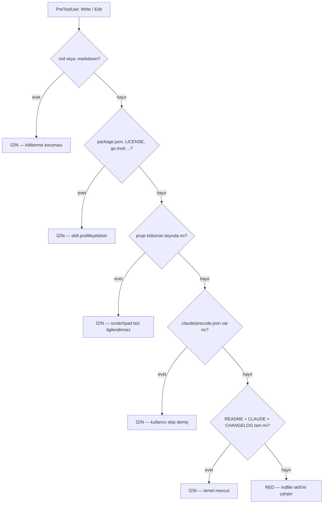

<div align="center">

# precode

### Dokümansız projeye kod yazılmasını **bir kez** engelleyen kapı

Bir `PreToolUse` hook'u *ne zaman*'ı, bir skill *nasıl*'ı halleder.
Dokümanlar oluştuğunda kapı bir daha rahatsız etmez.

<br/>

[](.claude-plugin/plugin.json)
[](../LICENSE)


</div>

---

> [!TIP]
> ```
> /plugin marketplace add OFThub/OFTagents
> /plugin install precode@oftagents
> ```
> Sonra Claude Code'u **yeniden başlatın** — hook'lar yalnızca oturum başında yüklenir.

---

## Sorun

Claude Code, README'si olmayan bir projeye seve seve kod yazmaya başlar; dokümanlar ya hiç
yazılmaz ya da çok geç yazılır.

Bunu tek başına bir skill çözemez — skill'leri Claude kendi takdirine göre yükler. Garanti
ancak bir hook ile mümkün. `precode` bu yüzden birbirine muhtaç iki parçadan oluşur.

## İki parça

| Parça | Görevi | Nerede |
| --- | --- | --- |
| **Kapı** | *ne zaman* — `Write`/`Edit` üzerinde deterministik kontrol | `hooks/hooks.json` + `scripts/docs-gate.mjs` |
| **Skill** | *nasıl* — tespit, profilleme, eksik soru, standarttan üretim | `skills/mdfile/` |
| **Komut** | elle kontrol ve kaçış kapısı | `commands/docs.md` |

## Kapı nasıl karar verir



> [!WARNING]
> Birinci dal kritik. `.md` beyaz listesi olmadan kapı, **kendi talep ettiği dokümanların
> yazılmasını da engellerdi** ve proje kapıyı asla açamazdı. `docs-gate.test.mjs` bunu
> *deadlock guard* testiyle koruyor.

**Kapı hiçbir şey yazmaz.** Salt-okunur bir kontrolün yan etkisi olmamalı ve kullanıcının
projesinde izinsiz klasör açmamalı. `decide()` saf bir fonksiyondur; dosya sistemi dışarıdan
enjekte edilir.

## 📦 Kurulum

| Kaynak | Komut |
| --- | --- |
| GitHub (önerilen) | `/plugin marketplace add OFThub/OFTagents` |
| GitHub, tam URL | `/plugin marketplace add https://github.com/OFThub/OFTagents` |
| Yerel geliştirme | `/plugin marketplace add C:\Projects\OFTagents` |

```
/plugin install precode@oftagents
```

> [!IMPORTANT]
> Kurulumdan sonra Claude Code'u **yeniden başlatın**. `/hooks` ile `PreToolUse` girdisinin
> listelendiğini doğrulayabilirsiniz.

## ⌨️ Komut

| Komut | Ne yapar | Yazar mı |
| --- | --- | --- |
| `/precode:docs check` | Durum raporu — hangi doküman eksik | Hayır |
| `/precode:docs init` | `mdfile` skill'ini elle çalıştırır | Dokümanları |
| `/precode:docs skip` | Bu proje için kapıyı kalıcı kapatır | `.claude/precode.json` |
| `/precode:docs unskip` | Kapıyı geri açar | Durum dosyasını siler |

Argüman verilmezse `check` çalışır.

## ⚙️ Özelleştirme

Zorunlu doküman listesi koda gömülü **değil** — `config/required-docs.json` içinde:

| Alan | Anlamı |
| --- | --- |
| `core` | Kapının aradığı dosyalar. Bunu değiştirmek kod değil **veri** değişikliğidir. |
| `allowExtensions` | Asla engellenmeyen uzantılar. |
| `allowFilenames` | Asla engellenmeyen dosya adları (manifest'ler). Büyük/küçük harf duyarsız. |
| `stateFile` | `skip` durumunun yazıldığı yol, proje köküne göreli. |

> [!CAUTION]
> **`allowExtensions` içinden `.md`'yi silmeyin.** Kapı kendi istediği dokümanların
> yazılmasını engeller ve proje kalıcı olarak kilitlenir.

Bu dosyayı hem kapı hem skill okur. Tek doğruluk kaynağı olması bilinçli: iki ayrı liste
tutulsaydı biri diğerinden sapar ve kapı, skill'in ürettiği setle asla tatmin olmazdı.

## ⚖️ Bilinen ödünler

<details>
<summary><strong>Node başlatma gecikmesi</strong> — dokümanlar tamamlandıktan sonra da sürer</summary>

<br/>

Kapı her `Write`/`Edit` için bir Node süreci doğurur (~200-400 ms). Önbellek bunu çözmez:
süre `stat` çağrılarından değil Node'un açılışından gelir. Yalnızca `Write` ile eşleştirmek
ucuzlatırdı ama mevcut/dokümansız projelerde Claude çoğunlukla yalnızca `Edit` yapar ve kapı
hiç tetiklenmezdi — asıl kullanım senaryosu ölürdü. Rahatsız ediyorsa: `/precode:docs skip`.

</details>

<details>
<summary><strong>Varlık kontrol edilir, kalite değil</strong></summary>

<br/>

Boş bir `README.md` kapıyı açar. Kapı bir bootstrap yardımcısıdır, uyumluluk denetçisi değil.
Kaliteyi zorlamak, kaçınılmaz olarak yanlış pozitif üreten bir denetçi gerektirirdi.

</details>

<details>
<summary><strong>Monorepo kapsam dışı</strong></summary>

<br/>

Kök dokümanlıysa `packages/*` altı sorgulanmaz. Alt paket başına kapı, ilk kurulumda onlarca
blok anlamına gelirdi.

</details>

<details>
<summary><strong>Node yoksa kapı sessizce açılır</strong> — bilinçli tercih</summary>

<br/>

Kabuk 127 döner; hook sözleşmesinde 2 dışındaki çıkış kodu *engellemeyen* hatadır. Bozuk bir
kapı oturumu kilitlememeli. Bozuk JSON, boş girdi ve hedefsiz payload da aynı şekilde
`exit 0` ile geçer.

</details>

## 🧪 Geliştirme

```bash
node scripts/docs-gate.test.mjs
```

Framework yok, disk yok — `decide()` saf fonksiyon, dosya sistemi enjekte edilir.

Kapıyı elle denemek için gerçek bir hook payload'ı gönderin:

```bash
echo '{"cwd":"/tmp/x","tool_name":"Write","tool_input":{"file_path":"/tmp/x/app.js"}}' \
  | node scripts/docs-gate.mjs
```

Dokümansız bir dizin için deny JSON'u basar; `app.js` yerine `README.md` verirseniz sessizce
`exit 0` döner.

## 🗑 Kaldırma

```
/plugin uninstall precode
```

Ya da tek bir projede kapatmak için o projeye `.claude/precode.json` dosyasını
`{"status":"skipped"}` içeriğiyle bırakın. Bu dosya commit'lenmelidir — takım geneline yayılan
bilinçli bir karardır.

---

<div align="center">
<sub>

**precode** · [OFTagents](../) marketplace'inin bir parçası · MIT

</sub>
</div>
