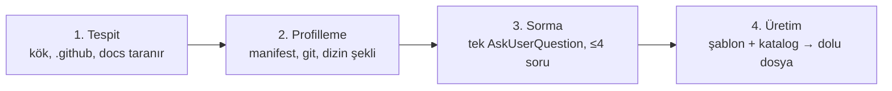

<div align="center">

# mdfile

### Projenin ne olduğuna bakarak dokümantasyonunu üreten skill

Şablon boşaltıcısı değil: önce projeyi profiller, çıkarabildiğini çıkarır,
yalnızca çıkaramadığını sorar.

<br/>

[](SKILL.md)


</div>

---

> [!NOTE]
> **`SKILL.md` Claude'un yüklediği dosyadır. Bu `README.md` insan içindir.** Auto-discovery
> yalnızca `SKILL.md`'ye bakar, ikisi aynı klasörde sorunsuz durur.

---

## Akış



| Adım | Yapılan | Neden |
| --- | --- | --- |
| **1. Tespit** | Kök, `.github/`, `docs/` taranır | Var olanın üzerine **asla** yazılmaz |
| **2. Profilleme** | `package.json`, `go.mod`, `git remote`, dizin şekli okunur | Çıkarılan her bilgi, sorulmayan bir sorudur |
| **3. Sorma** | **Tek** `AskUserQuestion`, ≤4 soru | Yalnızca 2. adımın cevaplayamadıkları |
| **4. Üretim** | Şablon + katalog → dolu dosya | Yapı doğaçlama değil, yayımlanmış standarttan |

2. adım skill'in değerinin durduğu yer. Onsuz bu bir şablon boşaltıcısı olurdu.
`package.json`'da yazan proje adını kullanıcıya sormak, skill'e olan güveni bitirir.

## Doküman katmanları

Kapı yalnızca **çekirdeği** zorlar. Üst katmanlar önerilir, dayatılmaz — hem sert blok hem
on iki dosya dayatması katlanılmaz olurdu.

| Katman | Dosyalar | Ne zaman |
| --- | --- | --- |
| 🟥 **Çekirdek** | `README.md` · `CLAUDE.md` · `CHANGELOG.md` | her zaman |
| 🟨 **Açık kaynak** | `CONTRIBUTING` · `SECURITY` · `CODE_OF_CONDUCT` · `LICENSE` · `.github/*` | public remote |
| 🟦 **Karmaşık** | `ARCHITECTURE.md` · `docs/adr/*` · `TESTING.md` | çok servisli / çok paketli |

Zorunlu liste burada değil, `${CLAUDE_PLUGIN_ROOT}/config/required-docs.json` içinde — kapı da
aynı dosyayı okur.

## Hangi standart, hangi dosya

`references/doc-catalog.md` her dosyayı yayımlanmış bir konvansiyona bağlar; üretim doğaçlama
olmaz.

| Dosya | Standart |
| --- | --- |
| `README.md` | [Standard Readme](https://github.com/RichardLitt/standard-readme) spec |
| `CHANGELOG.md` | [Keep a Changelog 1.1.0](https://keepachangelog.com) + [SemVer 2.0.0](https://semver.org) |
| `CONTRIBUTING.md` | GitHub community-health + [Conventional Commits 1.0.0](https://www.conventionalcommits.org) |
| `SECURITY.md` | GitHub güvenlik politikası şeması |
| `CODE_OF_CONDUCT.md` | [Contributor Covenant 2.1](https://www.contributor-covenant.org) — birebir |
| `ARCHITECTURE.md` | [arc42](https://arc42.org) (kısaltılmış) + [C4](https://c4model.com) seviye 1-2 |
| `docs/adr/*` | [Michael Nygard ADR](https://cognitect.com/blog/2011/11/15/documenting-architecture-decisions) formatı |
| normatif dil | [RFC 2119](https://www.rfc-editor.org/rfc/rfc2119) — MUST / SHOULD / MAY |

## Klasör yapısı

```
skills/mdfile/
├── SKILL.md                     ← Claude'un yüklediği talimat (~1.500 kelime)
├── README.md                    ← bu dosya, insan için
├── references/
│   └── doc-catalog.md           ← standart eşlemesi, yalnızca gerektiğinde yüklenir
└── assets/templates/            ← iskeletler, bağlama yüklenmez, çıktıda kullanılır
    ├── README.md  CLAUDE.md  CHANGELOG.md
    ├── CONTRIBUTING.md  SECURITY.md  CODE_OF_CONDUCT.md
    ├── ARCHITECTURE.md  TESTING.md  adr-0001.md
    └── github/  (PR + issue şablonları)
```

Bu ayrım **kademeli açığa çıkarma** (progressive disclosure):

| Katman | Ne zaman bağlama girer |
| --- | --- |
| Frontmatter (`name`, `description`) | her zaman |
| `SKILL.md` gövdesi | skill tetiklendiğinde |
| `references/`, `assets/` | ancak gerektiğinde |

## Yeni doküman türü ekleme

<details>
<summary><strong>Üç adım, kod değişikliği yok</strong></summary>

<br/>

1. `assets/templates/<DOSYA>.md` oluşturun; yer tutucular `{{...}}` içine yazılır.
2. `references/doc-catalog.md` içine bölüm sırasını ve bağlı olduğu standardı ekleyin.
3. Zorunlu olacaksa `config/required-docs.json` → `core` dizisine ekleyin.

Kod değişikliği gerekmez. Gerekiyorsa, konfigürasyona taşınması gereken bir şey koda gömülmüş
demektir.

</details>

## Değişmez kural

> [!CAUTION]
> **Hiçbir `{{...}}` yer tutucusu çıktıya sızmaz.** Doldurulmamış şablon, dosya olmamasından
> kötüdür: dokümantasyon gibi görünür, hiçbir bilgi taşımaz. Doldurulamıyorsa ya sorulur ya o
> bölüm tamamen silinir.

Sızıntı kontrolü **daima düz `{{` araması** olmalıdır. Şablonlardaki yer tutucular tek biçimde
değil — `{{PROJECT_NAME}}`, `{{path}}`, `{{WHAT_IT_IS — one paragraph}}` gibi formlar var.
Büyük harfe göre yazılmış bir desen 71 yer tutucunun yalnızca 45'ini yakalar; **%37'si sessizce
kaçar.**

---

<div align="center">
<sub>

**mdfile** · [precode](../../) plugin'inin skill'i · MIT

</sub>
</div>
